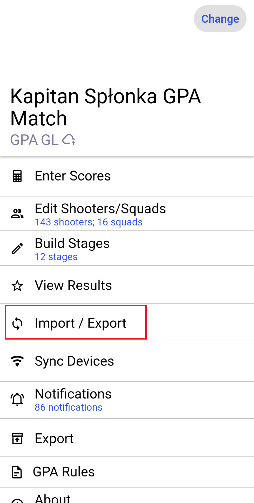
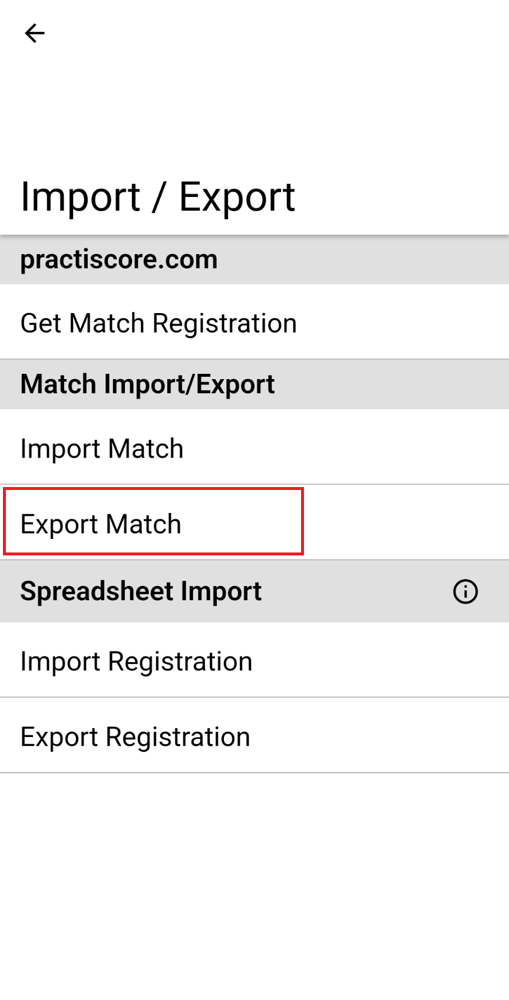

# PractiScore Diplomas Generator

Create diploma documents from a PractiScore match export. The program reads the results, applies your award rules, and creates one document containing all selected diplomas.

This guide is for match organizers. You do not need Python or any programming tools to use the Windows application.

## What You Need

Before starting, prepare these files:

| Item | What it is |
| --- | --- |
| PractiScore export | The `.psc` file exported from PractiScore after the match. |
| Configuration | A YAML file that defines award rules. Ready-to-use examples are in the `configs` folder. |
| Diploma template | A `.docx` or `.odt` document containing the text placeholders described below. |

Keep the `configs` folder next to `practiscore-diplomas.exe`. You can keep match exports and templates in the same folder, which makes them easier to select.

## Export The Match From PractiScore

Export the match only after scores and match status are final.

1. On the main match screen, choose **Import / Export**.

   

2. In the **Match Import/Export** section, choose **Export Match**.

   

3. Save the exported match file. Select this file as the PractiScore export when creating diplomas.

## Fastest Way To Create Diplomas

1. Double-click `practiscore-diplomas.exe`.
2. Use the up/down arrows and Enter to select **Render diplomas from a PractiScore file**.
3. Choose the award configuration, the `.psc` match export, and the diploma template.
4. In the save window, accept the suggested filename or choose another one.
5. When the success message appears, open the generated document and check the first few diplomas before printing.

The lists show files found in the current folder. Choose **Choose file** to use the standard Windows file picker instead. If you close that window without selecting a file, you return to the list.

This direct workflow also creates two YAML files alongside the final document:

```text
shooters-summary-<match-name>.yaml
diplomas-data-<match-name>.yaml
```

They are useful for checking who was included and why. Keep them with the match records.

## When To Use Each Menu Option

| Menu option | Use it when |
| --- | --- |
| Render diplomas from a PractiScore file | The normal choice. It parses the match, saves review data, and creates the final document in one operation. |
| Parse a PractiScore file into YAML | You want to inspect or manually adjust the selected diplomas before rendering. |
| Render diplomas from diploma-data YAML | You already have reviewed `diplomas-data-*.yaml` and want to create the document again, perhaps with a different template. |

For manual adjustments, first choose **Parse a PractiScore file into YAML**. Open `diplomas-data-<match-name>.yaml` in a text editor, make careful changes, then choose **Render diplomas from diploma-data YAML**. This is useful for correcting a displayed name, removing a specific diploma, or changing text before printing.

## Choosing A Configuration

The `configs` folder contains example award rules:

| File | Intended use |
| --- | --- |
| `gpa_t1_config.yaml` | GPA Tier 1 matches. |
| `idpa_t1_config.yaml` | IDPA Tier 1 matches. |
| `idpa_t2_config.yaml` | IDPA Tier 2 matches. |

Start with the configuration closest to your match. Make a copy before changing it so the original example remains available.

The configuration controls award series, such as division winners, category winners, fastest competitor, and most accurate competitor. It also decides who is eligible. By default, the supplied configurations exclude DQ and DNF competitors. A failed Chrono check is treated as DNF unless the configuration changes that setting.

### Common Configuration Changes

You may need to edit the configuration if your match uses different divisions, categories, award counts, or wording. The main concepts are:

| Setting | Meaning |
| --- | --- |
| `series` | The award series to create. Each named entry becomes a separate ranking. |
| `type` | `best_shooter`, `most_accurate`, or `fastest`. |
| `group_by` | Split the ranking by `division`, `class`, or `category`. |
| `min_competitors` | Number of competitors required for each additional diploma. `[1, 6, 11]` gives 1 diploma for 1-5 people, 2 for 6-10, and 3 for 11 or more. |
| `filters` | Include or exclude divisions, categories, or classes. Patterns are regular expressions. |
| `text` | The lines printed on the diploma. |

If a configuration error appears, check quotation marks, indentation, and the spelling of division/category names. YAML indentation matters: use spaces, not tabs.

## Configuration Reference

Configuration files use YAML. Start by copying the closest example from `configs`, then edit the copy in a text editor. Keep the indentation consistent: use spaces, never the Tab key.

The main parts of a configuration are:

```yaml
exclude_shooters:
  surnames: []
  ids: []
mark_chrono_failure_as_dnf: true
maps: {}
series: {}
```

### Award Series

Each entry under `series` describes one kind of diploma. The entry name is only an internal label, so choose a short, meaningful name. This example creates division awards:

```yaml
series:
  best_in_division:
    type: best_shooter
    group_by: [division]
    min_competitors: [1, 6, 11]
    text:
      first_line: "{{ division }} DIVISION"
      second_line: "{{ place }} PLACE"
```

| Setting | What it controls |
| --- | --- |
| `type` | Ranking method: `best_shooter` selects the best overall result, `most_accurate` selects the lowest points-down result, and `fastest` selects the lowest raw time. |
| `group_by` | Creates separate rankings for each listed value: `division`, `class`, and/or `category`. Leave it out for one ranking covering everyone. |
| `min_competitors` | Award thresholds. `[1, 6, 11]` gives one diploma for 1-5 eligible people, two for 6-10, and three from 11 onward. `[5]` gives no diploma below 5 people and one from 5 onward. |
| `exclude_dq` | When `true`, DQ competitors cannot receive this award. The default is `true`. |
| `exclude_dnf` | When `true`, DNF competitors cannot receive this award. The default is `true`. |
| `ineligible_penalties` | A list of penalty names that make a competitor ineligible for this one series. Use the penalty name exactly as it appears in the export. |

Every series needs `type`, `text.first_line`, and `text.second_line`. `group_by`, filters, penalty rules, and the third and fourth text line are optional.

### Filters

Filters limit a series to selected divisions, categories, or classes. They use regular expressions. A pattern is matched against the complete PractiScore value, so use `.*` when the registration text continues after the code.

```yaml
filters:
  divisions:
    include: ["CPI.*", "CPO.*"]
  categories:
    exclude: ["Lady.*"]
```

The example includes divisions whose registration name begins with `CPI` or `CPO`, while excluding the Lady category. The available filter groups are `divisions`, `categories`, and `classes`.

| Form | Meaning |
| --- | --- |
| Omit `filters` or a filter group | Include all values. |
| `include` | Include only values matching at least one listed pattern. |
| `exclude` | Exclude values matching a listed pattern. Exclusion takes priority over inclusion. |
| A simple list, such as `divisions: ["CPI.*"]` | Short form of `include`. |

### Maps And Diploma Line Text

Maps turn a value from PractiScore into the shorter wording printed on a diploma. They are especially useful when a division or category contains registration details that should not appear in the title.

```yaml
maps:
  division_code:
    "CPI.*": CPI
    "CPO.*": CPO
  division_place:
    1: CHAMPION
    2: 2nd PLACE
    3: 3rd PLACE
```

The program checks map entries from top to bottom and uses the first matching entry. Put more specific patterns before general ones. Quote text patterns such as `"CPI.*"`; numeric keys, such as places, do not need quotes.

The `text` section defines up to four lines for each diploma. The first two are required; the third and fourth are optional.

```yaml
text:
  first_line: "{{ division_code(division) }} DIVISION"
  second_line: "{{ division_place(place) }}"
  third_line: "{{ shooter.raw_time }} s"
  fourth_line: "{{ shooter.points_down }} PD"
```

Use `{{ field }}` to insert a value, and `{{ map_name(field) }}` to use a map. The following values can be used in diploma lines:

| Value | Meaning |
| --- | --- |
| `division`, `category`, `class` | The value that defines the current award group. |
| `place` | Place in the award ranking. |
| `type` | Award type: `best_shooter`, `most_accurate`, or `fastest`. |
| `shooter.shooter_id` | Visible GPA or IDPA competitor number. |
| `shooter.first_name`, `shooter.last_name` | Competitor name. |
| `shooter.division`, `shooter.categories`, `shooter.class` | Values recorded for the competitor in PractiScore. |
| `shooter.raw_time`, `shooter.points_down`, `shooter.steel_misses`, `shooter.penalty_seconds`, `shooter.total_time` | Result values. |
| `shooter.dnf`, `shooter.dq`, `shooter.shooter_uid` | Competitor status and internal identifier. |

These YAML text lines provide `first_line` through `fourth_line` to the document template. The placeholders in the DOCX or ODT template are described in the next section; map calls are used in the configuration, not directly in the document template.

### Excluding Specific Shooters And Chrono Failures

Use `exclude_shooters` to remove non-competitors, test records, or a PAR-time record from every award series. `surnames` and `ids` are regular-expression lists; either list can be empty.

```yaml
exclude_shooters:
  surnames: ["(?i)^par$"]
  ids: []
```

`mark_chrono_failure_as_dnf: true` is the default. When a match has a Chrono stage, a competitor whose gear check is not marked Pass is treated as DNF. Change it to `false` only when the match rules require a different result.

## Prepare A Diploma Template

Use a DOCX or ODT file as the template. Place placeholders wherever the changing text should appear. For example:

```text
{{ first_line }}
{{ second_line }}
{{ shooter.first_name }} {{ shooter.last_name }}
```

The program makes one copy of the template for every diploma. It keeps the document formatting, including font, size, alignment, and tables. The release includes `example-diploma-template.docx`, a small working example.

### Template Fields

| Field | Meaning |
| --- | --- |
| `first_line` | First line defined by the award configuration. |
| `second_line` | Second line defined by the award configuration. |
| `third_line` | Optional third line. Empty when the series does not define it. |
| `fourth_line` | Optional fourth line. Empty when the series does not define it. |
| `place` | Competitor's place in that award ranking. |
| `division` | Division used for the award. |
| `category` | Category used for the award. |
| `class` | Class used for the award. |
| `metric_value` | Ranking value, for example time or points down. |
| `shooter.shooter_id` | Visible GPA or IDPA competitor number. |
| `shooter.first_name` | Competitor's first name. |
| `shooter.last_name` | Competitor's last name. |
| `shooter.division` | Division recorded in PractiScore. |
| `shooter.categories` | Categories, shown as comma-separated text. |
| `shooter.class` | Class recorded in PractiScore. |
| `shooter.raw_time` | Total raw time before penalties. |
| `shooter.points_down` | Total points-down count. |
| `shooter.steel_misses` | Total missed steel targets. |
| `shooter.penalty_seconds` | Time added for penalties. |
| `shooter.total_time` | Raw time plus penalties. |
| `shooter.dnf` | `True` when the competitor is DNF. |
| `shooter.dq` | `True` when the competitor is DQ. |
| `shooter.shooter_uid` | Internal PractiScore identifier. Usually not needed on a diploma. |

Use the exact spelling and braces shown above. Unknown fields stop rendering so that a typo does not silently produce an incorrect diploma.

## Output Formats

| Output | Notes |
| --- | --- |
| DOCX | Best choice when the template is DOCX and you may still edit the document. |
| ODT | Works directly when using an ODT template. |
| PDF | Requires LibreOffice installed with `soffice` available on the Windows `PATH`. |

Converting between DOCX and ODT also requires LibreOffice. If you use the interactive mode, the file extension selected in the save window determines the output format.

## Command-Line Use

Interactive mode is recommended. The commands below are useful when repeating the same workflow or when automating a known process.

Render directly from a match:

```powershell
practiscore-diplomas render `
  -i "match-export.psc" `
  -c "configs\gpa_t1_config.yaml" `
  -t "diploma-template.docx" `
  --output-docx "diplomas.docx"
```

Create review data only:

```powershell
practiscore-diplomas parse `
  -i "match-export.psc" `
  -c "configs\gpa_t1_config.yaml"
```

Render reviewed data:

```powershell
practiscore-diplomas render `
  -d "diplomas-data-Match-Name.yaml" `
  -t "diploma-template.docx" `
  --output-docx "diplomas.docx"
```

Use `--output-odt` or `--output-pdf` instead of `--output-docx` when needed. The output path after these options is optional; without it, the program creates a sensible default filename.

## Troubleshooting

| Problem | What to check |
| --- | --- |
| A match file is not listed | Confirm that it is a `.psc` export, or use **Choose file**. |
| No diploma was created for a division or category | Check the configuration's filters, `min_competitors`, and DNF/DQ rules. |
| A competitor is unexpectedly DNF | Check whether every stage has a score and whether Chrono was passed. |
| A placeholder causes an error | Check its spelling against the Template Fields table. |
| PDF output fails | Install LibreOffice and ensure `soffice` is available on `PATH`. |
| Text is not positioned correctly | Adjust the paragraph or table formatting in the template, then render again. |
